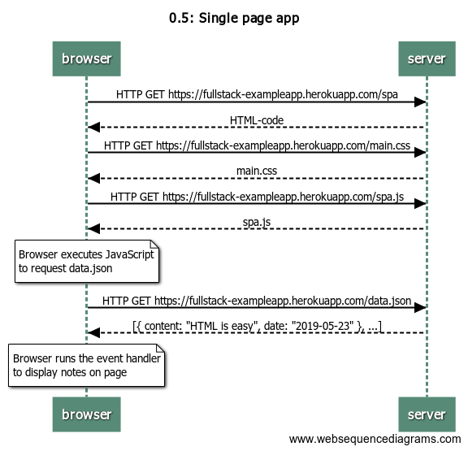
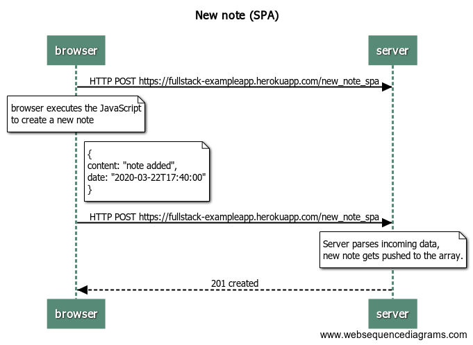

# Fullstack Open 2020 - Part 0

## 0.4 new note


```
title 0.4: new note

note right of browser:
form data gets sent through POST request
end note
browser->server: HTTP POST https://fullstack-exampleapp.herokuapp.com/new_note
note over server:
server receives the new note
and pushes it to the notes array
end note
server-->browser: URL redirect to /notes
note over browser:
Notes page gets refreshed by browser
end note
browser->server: HTTP GET https://fullstack-exampleapp.herokuapp.com/notes
server-->browser: HTML-code
browser->server: HTTP GET https://fullstack-exampleapp.herokuapp.com/main.css
server-->browser: main.css
browser->server: HTTP GET https://fullstack-exampleapp.herokuapp.com/main.js
server-->browser: main.js

note over browser:
Browser starts executing JavaScript and
requests JSON data from the server
end note

browser->server: HTTP GET https://fullstack-exampleapp.herokuapp.com/data.json
server-->browser: [{ content: "HTML is easy", date: "2019-05-23" }, ...]

note over browser:
Data from data.json gets
rendered by the browser
end note
```

## 0.5 Single Page Application



```
title 0.5: Single page app

browser->server: HTTP GET https://fullstack-exampleapp.herokuapp.com/spa
server-->browser: HTML-code
browser->server: HTTP GET https://fullstack-exampleapp.herokuapp.com/main.css
server-->browser: main.css
browser->server: HTTP GET https://fullstack-exampleapp.herokuapp.com/spa.js
server-->browser: spa.js

note over browser:
Browser executes JavaScript
to request data.json
end note

browser->server: HTTP GET https://fullstack-exampleapp.herokuapp.com/data.json
server-->browser: [{ content: "HTML is easy", date: "2019-05-23" }, ...]

note over browser:
Browser runs the event handler
to display notes on page
end note
```

## 0.6 New note (SPA)



```
title New note (SPA)


browser->server: HTTP POST https://fullstack-exampleapp.herokuapp.com/new_note_spa

note over browser
browser executes the JavaScript
to create a new note
end note
note right of browser
{
  content: "note added",
  date: "2020-03-22T17:40:00"
}
end note
browser->server: HTTP POST https://fullstack-exampleapp.herokuapp.com/new_note_spa
note over server:
Server parses incoming data,
new note gets pushed to the array.
end note
server-->browser: 201 created
```